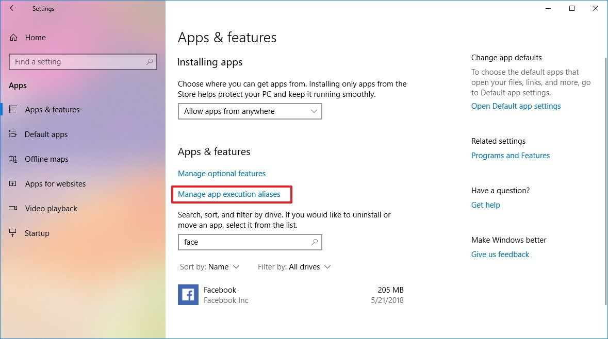
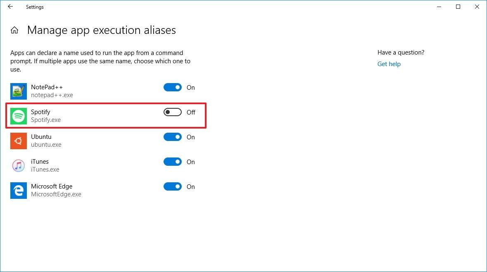

# How to specify which app can use a repeated alias name

If you have multiple apps using the same alias name, you can use these steps to select which app should use it:

1. Open Settings.  
2. Click on Apps.  
3. Click on Apps & features.  
4. Click the Manage app execution aliases link.  

5. Turn of the toggle switch for the apps that have the same execution name.  

Once you've completed the steps, running an alias app name using Command Prompt or Run command will only execute successfully for the app that has the toggle switch enabled.  
If you disable apps that do not have conflicting names, you'll prevent those apps from running when using a Windows console, and you'll end up with command "is not recognized as internal or external command, operable program or batch file" message. 
However, using this option will not affect launching the app from the Start menu.
